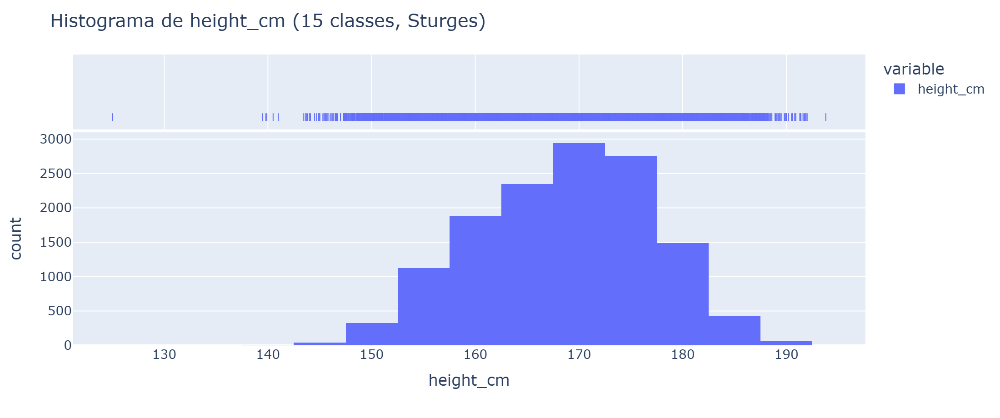
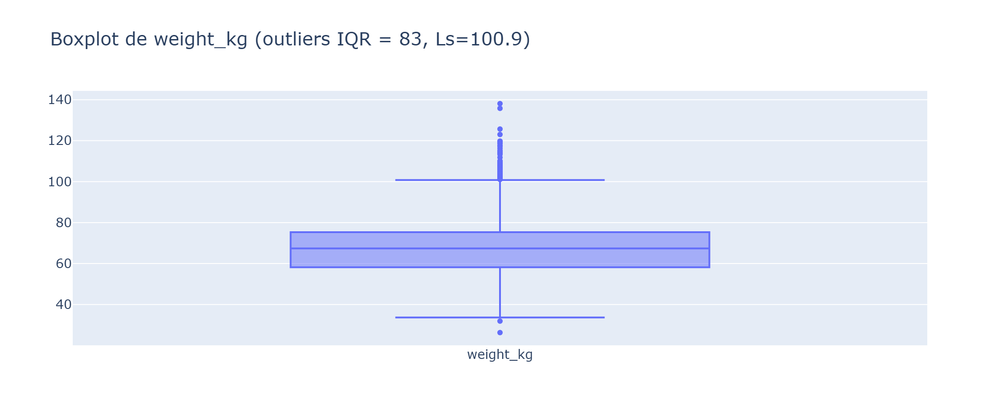
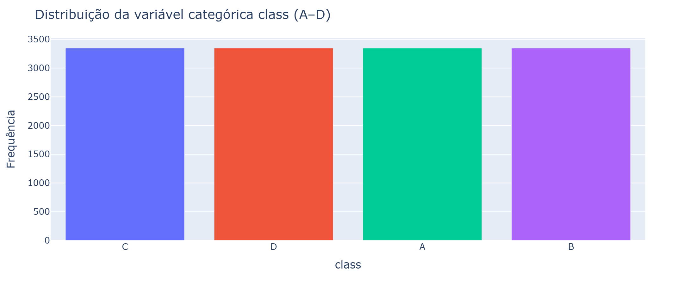
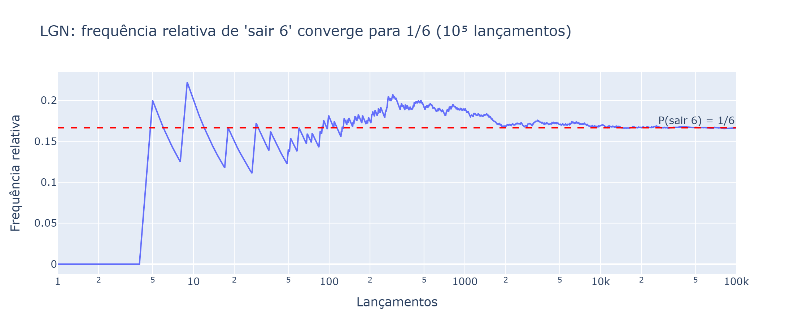
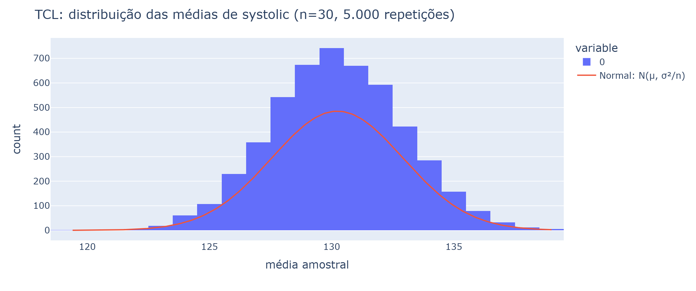
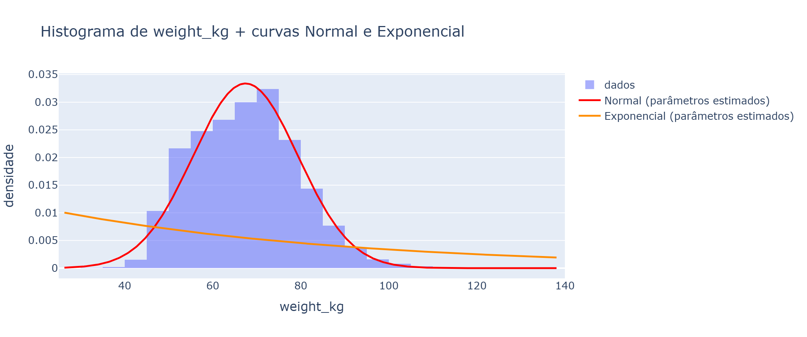
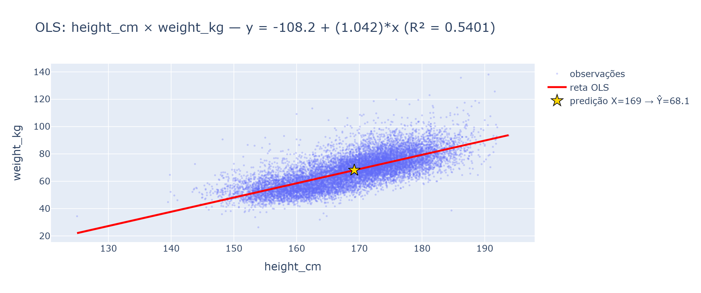

# RELATÓRIO — Laboratório Estatístico Interativo

**Disciplina:** Matemática e Estatística para Computação — Prof. Romes Heriberto
**Equipe:** *(NomeDoGrupo)*
**Componentes:** *(nomes e matrículas — repetir do README)*

---

## 1. Conjunto de dados: escolha e justificativa

**Fonte:** [Body Performance Data — Kaggle](https://www.kaggle.com/datasets/kukuroo3/body-performance-data)

- **13.393 registros** (exigência: ≥ 1.000 atendida).
- **10 variáveis numéricas** (exigência: ≥ 4 atendida) e **2 categóricas** (`gender`, `class`; exigência: ≥ 2 atendida).
- **Justificativa:** tema saúde/desempenho físico desperta análise genuína (o que faz alguém pular mais longe? como a força de preensão se relaciona com a idade?) e contém variáveis contínuas com formas distintas (simétricas e assimétricas), ideais para os 6 módulos — histogramas, TCL, ajuste de distribuições e regressão.

### Tabela de variáveis usadas

| Variável | Tipo | O que significa |
|---|---|---|
| `gender` | categórica | sexo (M/F) |
| `class` | categórica | classe de aptidão física (A a D) |
| `age` | numérica | idade (anos) |
| `height_cm` | numérica | altura (cm) |
| `weight_kg` | numérica | peso (kg) |
| `body fat_%` | numérica | percentual de gordura corporal |
| `diastolic` | numérica | pressão arterial diastólica |
| `systolic` | numérica | pressão arterial sistólica |
| `gripForce` | numérica | força de preensão (kg) |
| `sit and bend forward_cm` | numérica | flexibilidade (cm) |
| `sit-ups counts` | numérica | abdominais em 1 minuto |
| `broad jump_cm` | numérica | salto horizontal (cm) |

---

## 2. Decisões de implementação do núcleo estatístico

*TODO: prints da tela de cada módulo + fórmulas em notação matemática. Esqueleto abaixo.*

Todas as medidas em `nucleo/minhastats.py` foram escritas manualmente (sem `statistics`, sem `np.mean` etc.).

### Fórmulas implementadas (notação matemática)

**Tendência central**
- Média: $\bar{x} = \frac{1}{n}\sum_{i=1}^{n} x_i$
- Mediana: valor central da amostra ordenada (n ímpar) ou média dos dois centrais (n par).
- Moda: valor(es) de maior frequência; `[]` se todas as frequências forem 1.

**Dispersão**
- Amplitude: $R = x_{(n)} - x_{(1)}$
- Variância amostral: $s^2 = \frac{1}{n-1}\sum_{i=1}^{n} (x_i - \bar{x})^2$
- Variância populacional: $\sigma^2 = \frac{1}{n}\sum_{i=1}^{n} (x_i - \mu)^2$
- Desvio padrão: $s = \sqrt{s^2}$  e  $\sigma = \sqrt{\sigma^2}$
- Coeficiente de variação: $CV = \dfrac{s}{\bar{x}} \times 100\%$

**Posição**
- Percentil (método linear, type 7 do NumPy): ordena $x_{(0)}, \dots, x_{(n-1)}$; $h = (n-1)\frac{p}{100}$; $\hat{Q}_p = x_{(i)} + (h-i)(x_{(i+1)}-x_{(i)})$, com $i = \lfloor h \rfloor$.
- Quartis: $Q_1, Q_2, Q_3$ = percentis 25, 50, 75; $IQR = Q_3 - Q_1$.
- Outliers (regra do IQR): $x < Q_1 - 1{,}5\,IQR$ ou $x > Q_3 + 1{,}5\,IQR$.

**Relação**
- Covariância: $s_{xy} = \frac{1}{n-1}\sum_{i=1}^{n}(x_i - \bar{x})(y_i - \bar{y})$
- Pearson: $r = \dfrac{s_{xy}}{s_x\,s_y}$

**Regressão (mínimos quadrados)**
- $\hat{\beta} = \dfrac{s_{xy}}{s_x^2}$,   $\hat{\alpha} = \bar{y} - \hat{\beta}\bar{x}$,   $\hat{y} = \hat{\alpha} + \hat{\beta}x$,   $R^2 = r^2$

**Distribuições** (PDFs próprias em `nucleo/distribuicoes.py`)
- Normal: $f(x)=\frac{1}{\sigma\sqrt{2\pi}}e^{-\frac{(x-\mu)^2}{2\sigma^2}}$
- Exponencial: $f(x)=\lambda e^{-\lambda x}$, $\lambda=1/\bar{x}$
- Uniforme: $f(x)=\frac{1}{b-a}$, $a=\min$, $b=\max$

---

## 3. Validação contra as bibliotecas (resultados)

**Comando:** `pytest testes/ -v` → **44 testes passando.**

```text
............................................                             [100%]
44 passed in 2.27s
```

| Medida própria | Referência | Tolerância |
|---|---|---|
| `media` | `np.mean` | rtol 1e-10 |
| `mediana` | `np.median` | rtol 1e-10 |
| `variancia_amostral` | `np.var(ddof=1)` | rtol 1e-10 |
| `variancia_populacional` | `np.var(ddof=0)` | rtol 1e-10 |
| `desvio_padrao_*` | `np.std(ddof=1/0)` | rtol 1e-10 |
| `percentil` | `np.percentile` (linear) | rtol 1e-10 |
| `covariancia` | `np.cov(x,y,ddof=1)` | rtol 1e-10 |
| `correlacao_pearson` | `np.corrcoef` | rtol 1e-10 |
| `pdf_normal/exponencial/uniforme`, `pmf_poisson/binomial` | `scipy.stats` | rtol 1e-10 |
| `regressao_linear` (α, β, r) | `np.polyfit`, `scipy.stats.linregress` | rtol 1e-6 |

*TODO: (opcional) colar aqui a saída completa do `pytest -v` no seu ambiente.*

---

## 4. Cada módulo (prints + explicação)

### Módulo 2 — Estatística Descritiva Interativa

A aba recebe uma variável. Para variáveis contínuas gera tabela de frequências com classes
(regra de Sturges: k = ⌈log₂ n⌉ + 1), painel com todas as medidas calculadas pela biblioteca
própria, histograma e boxplot, detecção de outliers pela regra do IQR e interpretação automática.



Exemplo: `height_cm` tem média ≈ 168,6 cm, desvio ≈ 8,4 cm, CV = 5,00% e **10 outliers** pela
regra do IQR. A média praticamente coincide com a mediana (169,2 cm) → distribuição aproximadamente simétrica.



À esquerda, a mesma visão para `weight_kg`: 83 outliers acima de Q3 + 1,5·IQR. Para categóricas, a aba exibe
tabela + barras/pizza:



### Módulo 3 — Probabilidade e Simulação (Monte Carlo)

**Lei dos Grandes Números:** o usuário controla o nº de lançamentos do dado (p = 1/6) ou moeda
(p = 1/2); a frequência relativa acumulada converge para o valor teórico.



Após 100.000 lançamentos a frequência relativa de "sair 6" fica em ~0,167 (esperado 0,1667) —
convergência numérica do LGN.

**Teorema Central do Limite:** o usuário sorteia R amostras de tamanho n de uma variável do dataset
e observa a distribuição das médias amostrais, comparada com a Normal N(μ, σ²/n).



Com n = 30 e 5.000 repetições sobre `systolic`, a média das médias (≈130,24) iguala a média
populacional e o desvio das médias (≈2,3) aproxima σ/√30 — ou seja, a convergência descrita pelo TCL.

### Módulo 4 — Distribuições Teóricas

Histograma em densidade + curva(s) com parâmetros estimados dos próprios dados:



Em `weight_kg`, a curva **Normal**(μ̂ = 67,45; σ̂ = 11,95) acompanha bem o pico; a **Exponencial**
(λ̂ = 1/67,45) perde o ajuste porque os dados não decaem monotonamente a partir de zero — a
inspeção visual mostra qual modelo descreve melhor a variável.

### Módulo 5 — Correlação e Regressão Linear

Dispersão, reta de mínimos quadrados (implementada na mão), equação, R² e predição interativa:



Para `height_cm × weight_kg`: ŷ = −86,58 + 0,91·x, r = 0,7349 e R² = 0,5401 — cerca de 54% da
variação do peso é explicada linearmente pela altura. O campo de predição retorna ŷ para um X digitado
(a estrela dourada marca a predição para X = mediana).

---

## 5. Os 3 achados do laboratório (Módulo 6)

Valores gerados pela biblioteca própria; reproduzir na aplicação.

### Achado 1 — Altura é a variável mais "homogênea" da amostra
- **Evidência:** `height_cm` tem CV = **5,00%** (media ≈ 168,6; dp ≈ 8,4), enquanto `age` tem CV = **37,05%** e `sit-ups counts` CV = **35,90%**.
- **Interpretação:** a variabilidade relativa da altura é muito menor que a de idade/condicionamento; dito de outro jeito, a amostra é bem mais parecida em estatura do que em idade.

### Achado 2 — Peso "não anda junto" com percentual de gordura
- **Evidência:** r = **−0,0841** entre `weight_kg` e `body fat_%` (quase zero), enquanto r(`height_cm`, `weight_kg`) = **0,7349** e r(`sit-ups counts`, `broad jump_cm`) = **0,7483**.
- **Interpretação:** mais peso não implica mais gordura relativa (músculos pesam mais que gordura!). Correlação forte existe entre altura×peso e abdominais×salto.

### Achado 3 — Distribuições assimétricas convivem no mesmo dataset
- **Evidência:** `age` tem média (36,8) > mediana (32) → assimetria à direita (público mais jovem concentrado, cauda de idosos); `broad jump_cm` e `sit-ups counts` têm média < mediana → assimetria à esquerda.
- **Interpretação:** não existe "a curva dos dados"; cada variável pede distribuição e interpretação próprias — é exatamente o que os Módulos 2–4 mostram visualmente.

---

## 6. Limitações

Os dados do Body Performance Data são **transversais** (cross-sectional): capturam um retrato de
cada pessoa em um instante, não acompanham ninguém ao longo do tempo. Por isso as correlações e
regressões aqui apresentadas não permitem afirmar causalidade — "altura explica parte do peso" não
significa "aumentar a altura aumenta o peso". Além disso, a regressão é linear simples: não mede
efeitos conjuntos (ex.: altura, idade e gênero juntos) nem não-linearidades. A classe A–D é um
rótulo agregado fornecido pelo dataset, sem metodologia documentada de como foi derivada, e a
amostra pode não representar a população brasileira (não há variáveis socioeconômicas). Por fim, as
medidas de simulação utilizam sementes fixas para reprodutibilidade, mas trocar a semente produz
variações amostrais pequenas — o fenômeno estatístico descrito permanece o mesmo.

---

## 7. Vídeo de demonstração

**Link:** *(YouTube não listado ou Drive com acesso liberado)* — 3 a 5 min: dataset (30 s) → cada módulo rodando → explicação de um trecho do núcleo (ex.: percentil type 7) → melhor achado.